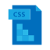
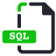
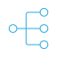

### Hi there, I'm Allison. Welcome to my Github!

## I am a lifelong student - I have rarely not found a subject that interests me.

- 💻 I'm currently working on Python, Django, & SQL in a year-long bootcamp at Nashville Software School.
- 📚 I'm currently learning All. The. Things.
- 👩🏻‍🌾 I'm not just a software engineer - I enjoy gardening, experimenting with fermentation, making soy cappuccinos, & kayaking.
- 🔮 2022 Goal: Graduate from the NSS bootcamp & land a new job that inspires me to delve deeper into the world of tech!
- 🎶 Fun Fact: I sang opera as a Soprano 1 (think HIGH notes) for six years during high school & college.

### Connect with me:

- [Linkedin](https://linkedin.com/in/allisonkosborne/)

### Languages & Tools:

